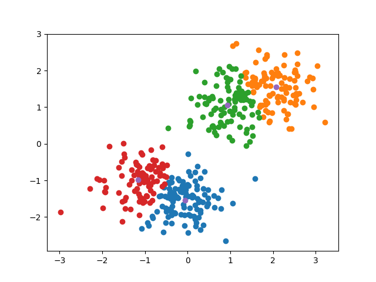

# K-means Clustering Implementation from Scratch

This repository contains a Python implementation of the K-means clustering algorithm from scratch, using only the NumPy library. K-means clustering is a popular unsupervised learning algorithm used for partitioning data into clusters based on similarity.

## Explanation

### My_Kmean Class

- `My_Kmean` is a Python class that represents the K-means clustering algorithm.
- It is initialized with the number of clusters (`n_clusters`) to be identified in the data.
- The `fit` method is responsible for fitting the K-means model to the given data.

### Fit Method

1. **Initialization**:
   - Randomly select `n_clusters` data points as initial centroids.

2. **Assignment**:
   - Iterate through each data point and assign it to the nearest centroid based on Euclidean distance.

3. **Update Centroids**:
   - Update each centroid by computing the mean of the data points assigned to it.

4. **Iteration**:
   - Repeat the assignment and centroid update steps until convergence or a maximum number of iterations is reached.
  

